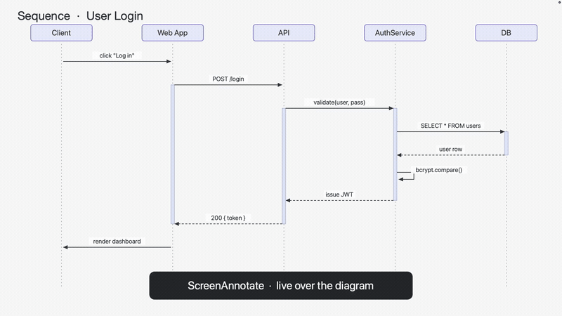

# ScreenAnnotate.spoon

A Hammerspoon [Spoon](https://www.hammerspoon.org/Spoons/) for presenting: draw
over the screen with the mouse, freeze it, then zoom and pan — all **recorded
like anything else on screen** (unlike native macOS zoom, which the display
compositor applies after screen capture and is invisible to OBS).

The screen stays *live* until you freeze it (a screenshot is taken). The first
drag, `ctrl`+left-click, or the freeze hotkey all freeze it. While frozen you can
draw, zoom, and pan on the still image while the apps underneath stay inert.
Unfreezing drops the screenshot and goes back to live without leaving the mode.

## Demo



> The GIF is downscaled for size — grab [`demo.mp4`](demo.mp4) for the
> full-resolution recording.

## Requirements

- [Hammerspoon](https://www.hammerspoon.org/)
- **Screen Recording** permission for Hammerspoon (for freezing the screen).
- For the optional native-zoom gesture: System Settings → Accessibility → Zoom →
  "Use keyboard shortcuts to zoom" enabled.

## Installation

Download and unzip into `~/.config/hammerspoon/Spoons/`, or clone it there
directly:

```sh
git clone https://github.com/thedenische/ScreenAnnotate.spoon.git \
  ~/.config/hammerspoon/Spoons/ScreenAnnotate.spoon
```

## Usage

In your `~/.config/hammerspoon/init.lua`, the minimal setup uses the default hotkeys
(`ctrl+alt+cmd+P` toggle, `ctrl+F` freeze, `escape` exit):

```lua
hs.loadSpoon("ScreenAnnotate")
spoon.ScreenAnnotate:bindHotkeys() -- uses ScreenAnnotate.defaultHotkeys
```

To customise, override any config field before binding, and pass your own
hotkeys (any subset — missing actions fall back to `ScreenAnnotate.defaultHotkeys`):

```lua
hs.loadSpoon("ScreenAnnotate")

-- Optional: override any config before binding / starting.
spoon.ScreenAnnotate.config.zoom.max = 2.0
spoon.ScreenAnnotate.config.pen.color = { red = 0, green = 1, blue = 0, alpha = 1 }

spoon.ScreenAnnotate:bindHotkeys({
  toggle = { { "ctrl", "alt", "cmd" }, "p" }, -- turn the mode on / off (global)
  freeze = { { "ctrl" }, "f" },               -- toggle freeze (while active)
  exit   = { {}, "escape" },                  -- exit the mode (while active)
})
```

## Controls

Keyboard (configurable via `:bindHotkeys`):

| Action   | Default          | Effect                                          |
| -------- | ---------------- | ----------------------------------------------- |
| `toggle` | `ctrl+alt+cmd+P` | Turn annotation mode on / off                   |
| `freeze` | `ctrl+F`         | Toggle freeze (or cancel native zoom)           |
| `exit`   | `escape`         | Exit annotation mode                            |

Mouse (while active):

| Gesture              | Effect                                                     |
| -------------------- | --------------------------------------------------------- |
| left-drag            | Draw a red pen line (freezes on first drag)               |
| right-drag           | Draw a yellow marker (freezes on first drag)              |
| shift+drag           | Draw an arrow (red on left, yellow on right)              |
| cmd+drag             | Draw a rectangle (red on left, yellow on right)           |
| left / right-click   | Ripple highlight (works on the live screen too)           |
| ctrl+left-click      | Freeze + toggle zoom (max ↔ normal) at the cursor         |
| ctrl+shift+lclick    | Native macOS zoom (live, **not** recorded by OBS)         |
| ctrl+scroll          | Zoom in / out (clamped between normal and max) at cursor  |
| move (while zoomed)  | Pan by holding the cursor at a screen edge (after a beat) |
| ctrl+right-click     | Clear + unfreeze (or cancel native zoom), stay in the mode |

## Configuration

Override any field of `spoon.ScreenAnnotate.config` after `hs.loadSpoon` and
before `:start()`. These are the defaults:

```lua
spoon.ScreenAnnotate.config = {
  -- Freehand pen (left button): colour + thickness.
  pen    = { color = { red = 1, green = 0.2, blue = 0.2, alpha = 1 }, width = 4 },
  -- Marker (right button): translucent colour + thickness.
  marker = { color = { red = 1, green = 0.9, blue = 0.1, alpha = 0.35 }, width = 16 },

  shapeWidth     = 4,   -- arrow / rectangle stroke width (crisp, independent of pen/marker)
  arrowHeadRatio = 4.5, -- arrowhead length as a multiple of the (zoom-adjusted) line width
  arrowWingDeg   = 28,  -- arrowhead half-angle (degrees)

  -- Click ripple (highlight) animation.
  ripple = {
    color      = { red = 1, green = 0.85, blue = 0.1, alpha = 1 },
    radiusFrom = 8,   -- start radius (px)
    radiusTo   = 45,  -- end radius (px)
    ringWidth  = 4,   -- ring thickness (px)
    duration   = 0.4, -- seconds
  },

  -- Zoom around the cursor.
  zoom = {
    max  = 1.75, -- max magnification
    step = 0.15, -- ctrl+scroll increment
    anim = 0.16, -- transition duration (s)
  },

  -- Edge panning while zoomed.
  pan = {
    edge  = 2,    -- px from the edge that triggers panning
    delay = 0.22, -- seconds at the edge before panning engages
    speed = 36,   -- px moved per tick while panning
  },

  fps           = 60, -- animation frame rate (ripple / zoom / pan)
  dragThreshold = 3,  -- px of movement before a press counts as a drag (jitter guard)
}
```

You can also set individual fields, e.g. `spoon.ScreenAnnotate.config.zoom.max = 2.0`.


## API

- `spoon.ScreenAnnotate:bindHotkeys(mapping)` — bind `toggle` / `freeze` / `exit`.
- `spoon.ScreenAnnotate:start()` / `:stop()` / `:toggle()` — control the mode
  programmatically.

## Known limitations

- **The first press on the live screen reaches the app underneath.** A drawing
  drag only freezes on the first real movement, so the initial `mousedown`
  (and any drag before the jitter threshold) is delivered to whatever is under
  the cursor. On a presentation desktop this is harmless, but it can start an
  accidental text selection or icon drag. Freeze first (`freeze` hotkey or
  `ctrl`+left-click) if the app underneath is drag-sensitive.
- **Native macOS zoom state is only tracked for gestures this Spoon triggers.**
  If you toggle the system zoom yourself (⌥⌘8) while annotation mode is on, the
  internal on/off tracking can drift until the next clear / exit.

## Development

The pure geometry helpers are exposed as `ScreenAnnotate._geom` and covered by
plain-Lua unit tests (no Hammerspoon required):

```sh
lua spec/geom_spec.lua      # Lua 5.3+ (Hammerspoon bundles 5.4)
luajit spec/geom_spec.lua   # LuaJIT (the spec adds a two-arg math.atan shim)
```

## License

[MIT](./LICENSE)
